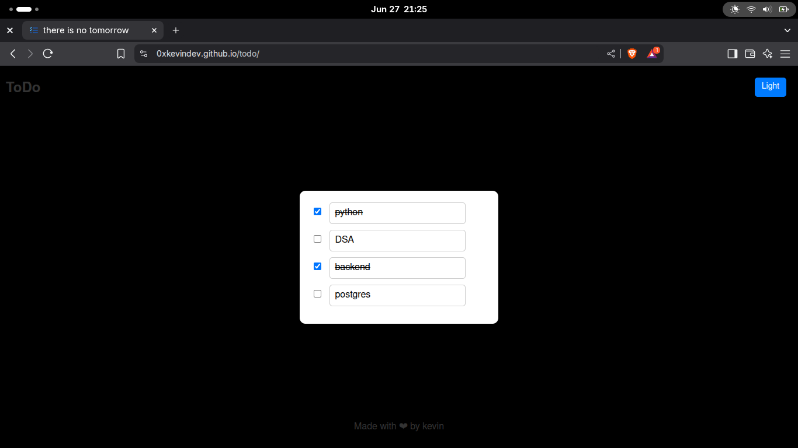

# Todo App (Frontend)

This is a simple **Todo Website** built using frontend technologies.

> ⚠️ This is my **second and last frontend project**—I don't really like frontend development. I prefer backend work.

---

## 📌 Features

* Add tasks
* Mark tasks as completed
* Delete tasks
* Clean, minimal UI

---

## 💻 Tech Stack

* HTML
* CSS
* JavaScript

---

## 🚀 How to Run

1. Clone the repo
2. Open `index.html` in your browser

---

## 🎯 Purpose

This project was part of my learning journey to understand basic frontend development. Even though I don't enjoy frontend much, I wanted to complete this second project to solidify the concepts.

From here on, I'm focusing entirely on **backend development**, which I truly enjoy.

---

## 📜 License

Feel free to use or modify this code however you want.

---
